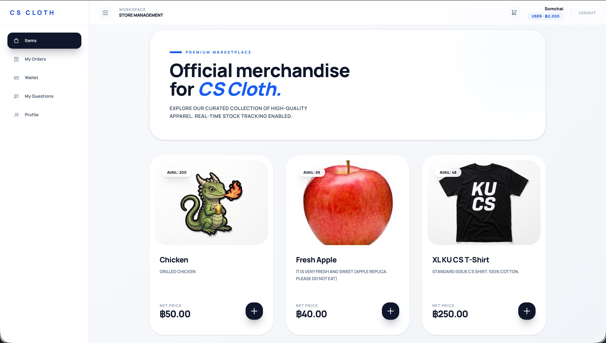
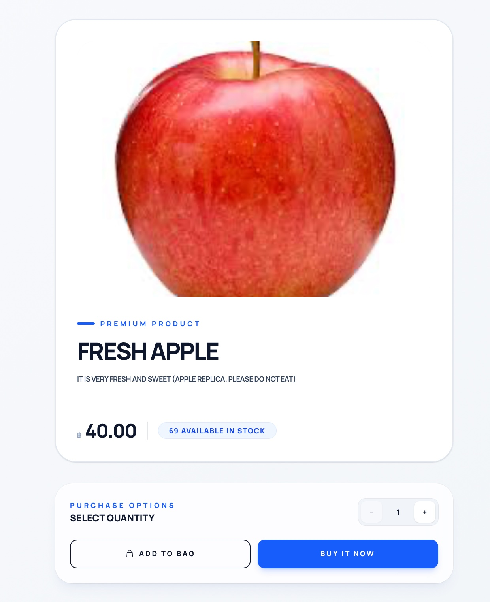
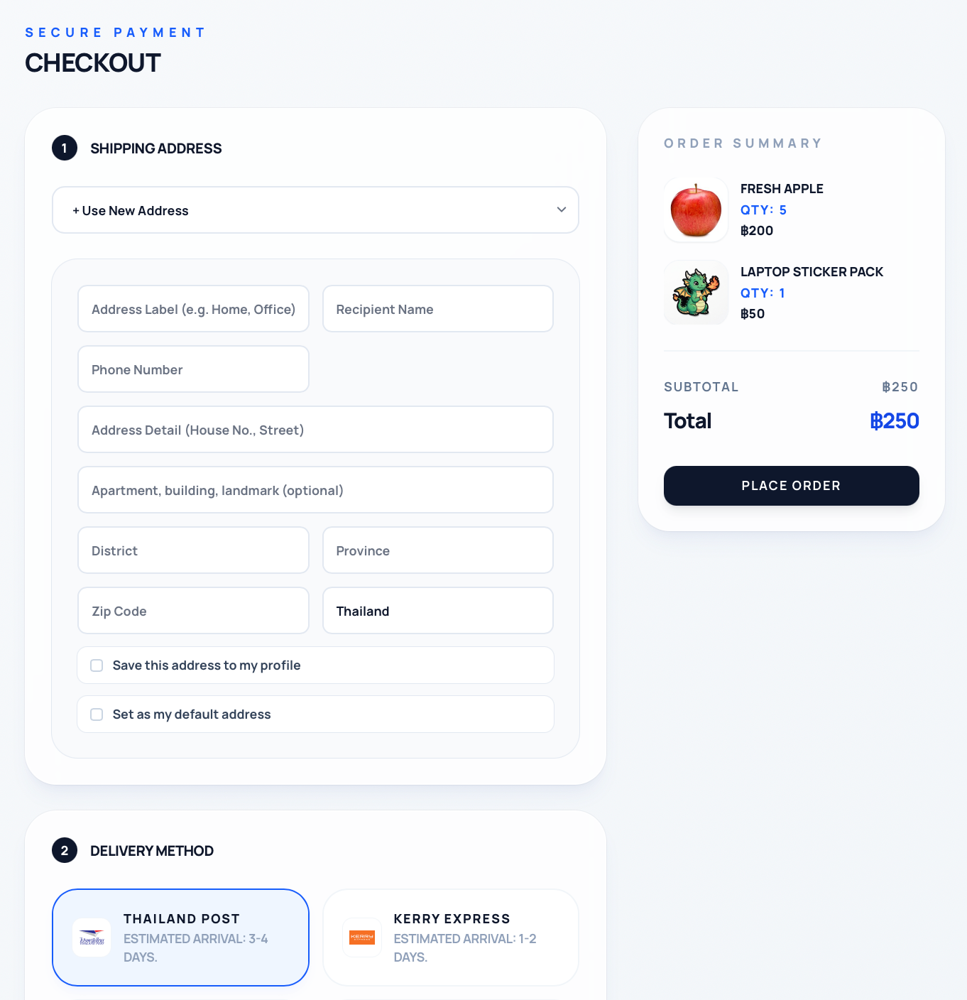
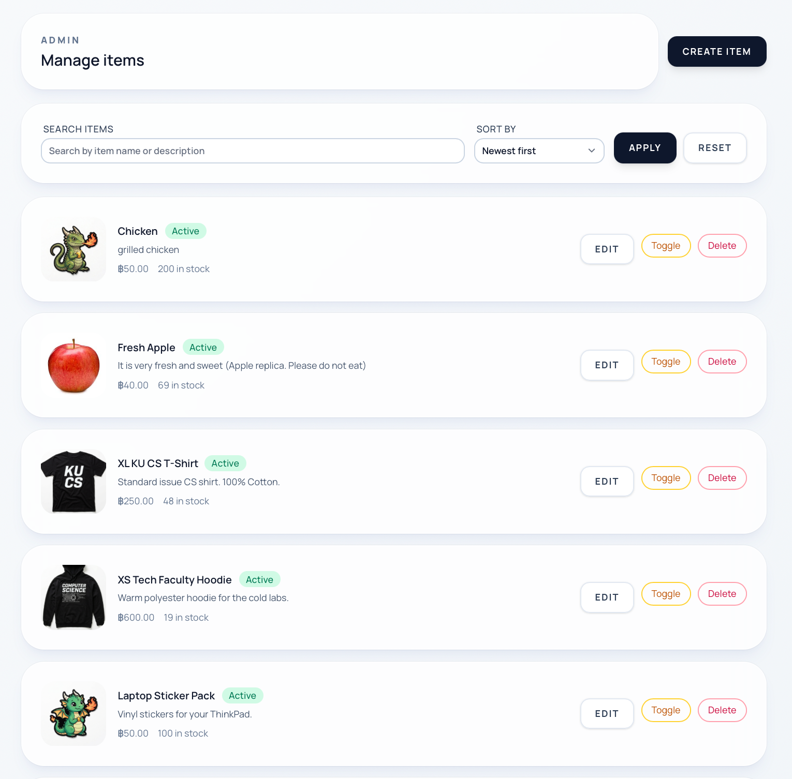
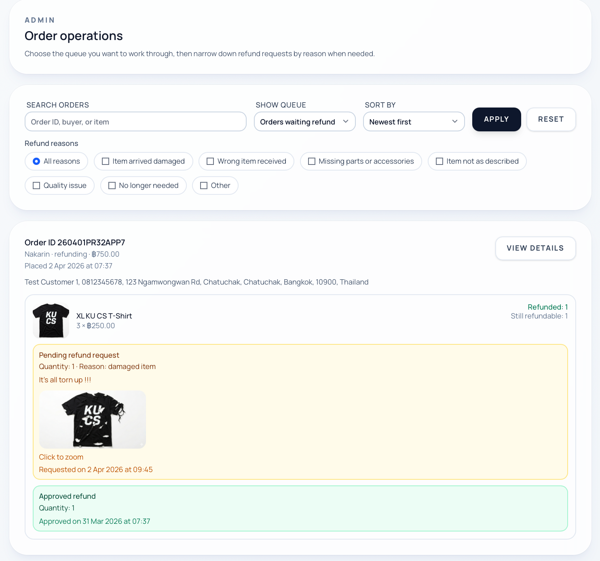
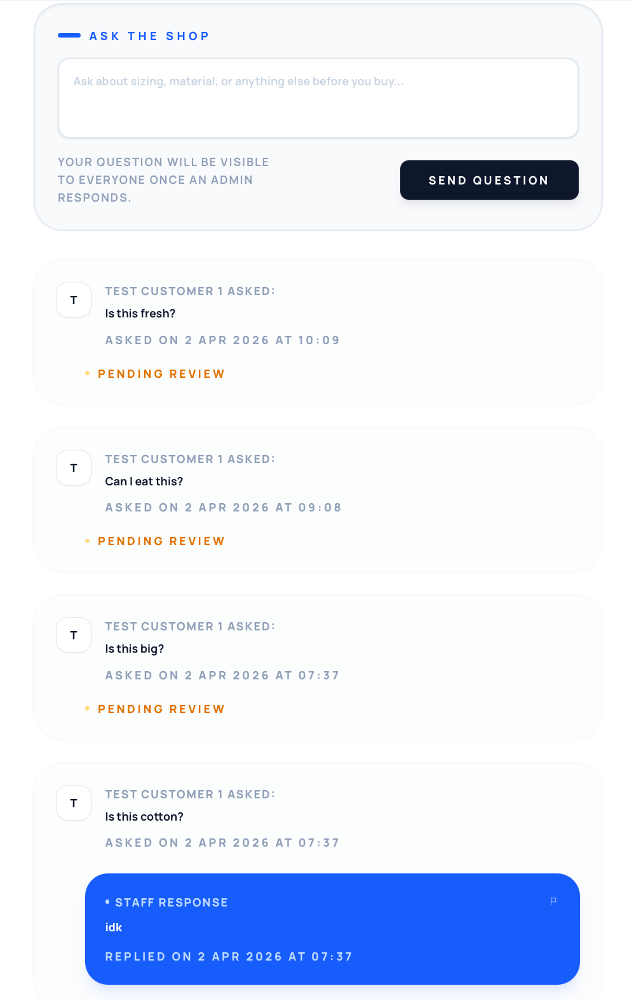
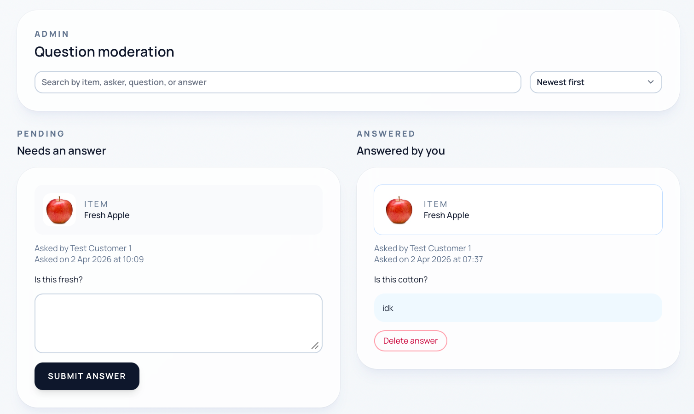
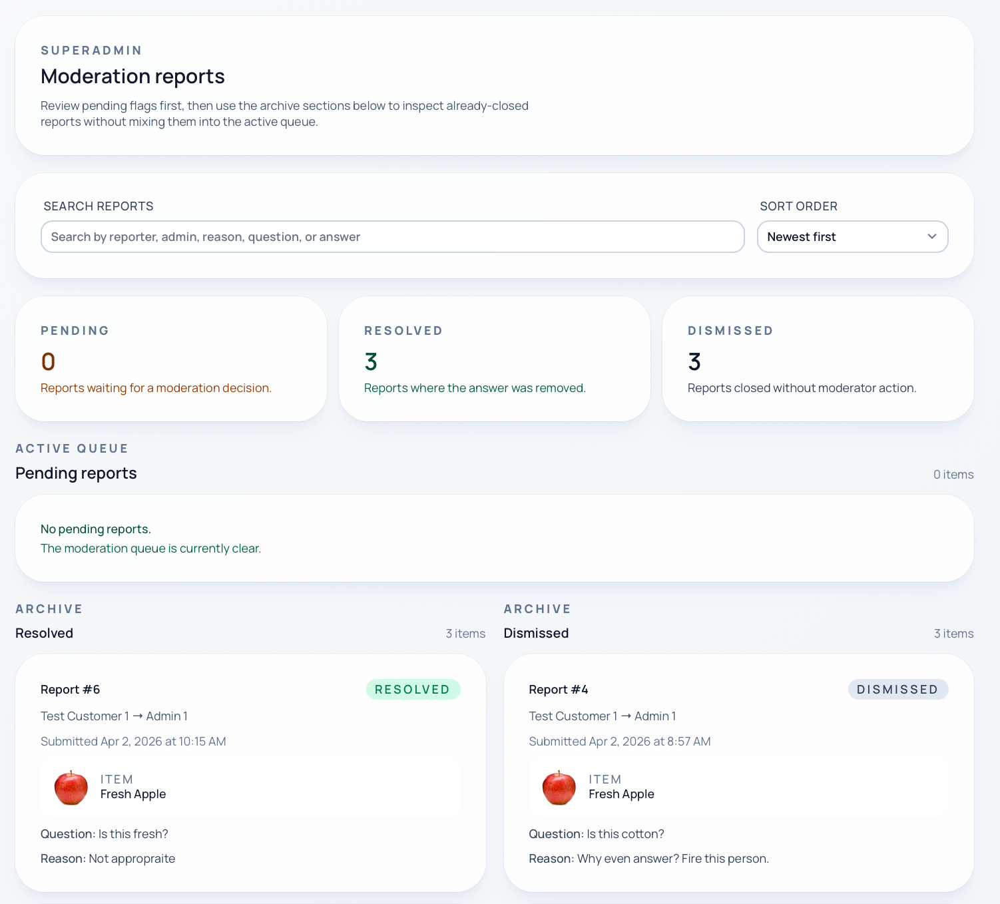
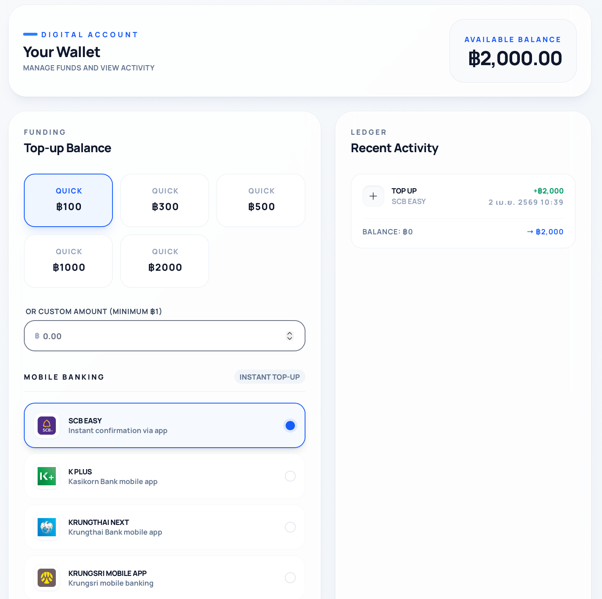
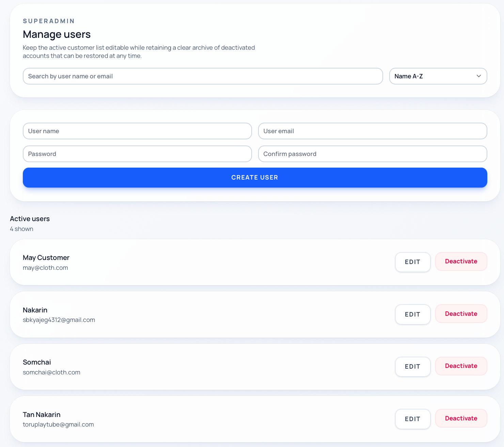

# CS Cloth

CS Cloth is a role-based merchandise storefront built with a Laravel API backend and a SvelteKit frontend. The current system supports public catalog browsing, customer checkout flows, admin inventory/order operations, and superadmin moderation/user management.

## Current System At A Glance

- `backend/`: Laravel 12 API with SQLite-by-default local setup
- `frontend/`: SvelteKit 2 application for storefront and back-office screens
- `backend/database/seeders/DatabaseSeeder.php`: demo users, sample items, sample orders, reports, wallet balances, and addresses
- `/`: redirects by role
- `/items`: main storefront entry point for guests and customers

## What The System Currently Does

### Customer-facing

- Browse the item catalog and view item details
- Register with email OTP verification
- Log in, log out, and reset passwords
- Manage profile information
- Add items to cart and checkout
- Manage saved delivery addresses
- View order history and order details
- Request order cancellation or refunds
- View wallet balance and top up funds
- Ask product questions and report inappropriate answers

### Admin-facing

- Create, edit, hide, and delete items
- Search and sort inventory
- Review orders and mark them as shipped
- Review refund requests and approve or dismiss them
- Answer or remove customer question responses

### Superadmin-facing

- Manage admin accounts
- Manage user accounts
- Review moderation reports
- Resolve or dismiss reported answers

## Main Routes

### Frontend

- `/items`: storefront listing
- `/items/[id]`: item detail page
- `/cart`: shopping cart
- `/checkout`: checkout flow
- `/orders`: customer orders
- `/wallet`: customer wallet
- `/questions`: customer question/report history
- `/profile`: customer profile
- `/admin/items`: admin inventory management
- `/admin/orders`: admin order management
- `/admin/questions`: admin Q&A moderation
- `/superadmin/reports`: superadmin moderation queue
- `/superadmin/admins`: superadmin admin management
- `/superadmin/users`: superadmin user management

### API

Key API groups live in [backend/routes/api.php](/Users/Tan/Uni/WebTech/CS-Cloth/backend/routes/api.php):

- `/api/auth/*`: login, register OTP, password reset, profile
- `/api/items*`: public catalog
- `/api/cart*`: cart operations
- `/api/orders*`: checkout, order history, cancel, refund
- `/api/wallet*`: wallet and top-up
- `/api/admin/*`: admin item/order/question actions
- `/api/superadmin/*`: superadmin user/admin/report actions

## Tech Stack

- Backend: Laravel 12, PHP 8.2+, SQLite for default local dev
- Frontend: SvelteKit 2, Svelte 5, TypeScript, Vite
- Styling: Tailwind CSS
- Auth: token-based API auth with role-aware routing

## Local Development Setup

This is the most aligned setup with the current repository state.

### Requirements

- PHP 8.2+
- Composer
- Node.js 20+
- npm
- SQLite

### 1. Backend setup

```bash
cd backend
composer install
npm install
cp .env.example .env
php artisan key:generate
php artisan migrate:fresh --seed
php artisan storage:link
```

Start the API:

```bash
cd backend
php artisan serve
```

Backend URL: `http://127.0.0.1:8000`

### 2. Frontend setup

For local development against `php artisan serve`, set `BACKEND_URL` to the Laravel server, not the Docker service name.

```bash
cd frontend
npm install
cp .env.example .env
```

Then edit `frontend/.env` to:

```env
BACKEND_URL=http://127.0.0.1:8000
```

Start the frontend:

```bash
cd frontend
npm run dev
```

Frontend URL: `http://127.0.0.1:5173`

## Seeded Demo Accounts

After `php artisan migrate:fresh --seed`, these accounts are available:

- Superadmin: `tan@cloth.com` / `asd123`
- Admin: `admin@cloth.com` / `asd123`
- User: `user@cloth.com` / `asd123`
- User: `may@cloth.com` / `asd123`

## Important Configuration Notes

- Backend local defaults use SQLite from [backend/.env.example](/Users/Tan/Uni/WebTech/CS-Cloth/backend/.env.example).
- Registration OTP and password reset flows rely on mail configuration. For full testing, configure SMTP in `backend/.env`.
- Uploaded item images are served from Laravel storage and stored under `backend/storage/app/public/items`.
- The frontend root page is not a marketing landing page; the usable storefront starts at `/items`, and `/` redirects by role/session state.

## Docker / Compose Status

The repository includes compose files:

- [docker-compose.yml](/Users/Tan/Uni/WebTech/CS-Cloth/docker-compose.yml)
- [backend/compose.yaml](/Users/Tan/Uni/WebTech/CS-Cloth/backend/compose.yaml)
- [frontend/docker-compose.yml](/Users/Tan/Uni/WebTech/CS-Cloth/frontend/docker-compose.yml)

Current note:

- Frontend env defaults are Docker-oriented (`BACKEND_URL=http://laravel-api`).
- The backend local `.env.example` is SQLite-oriented.
- Because of that split, the manual local setup above is the clearest documented path unless you intentionally align the Docker env files for Sail/MySQL.

## Screenshot Placeholders

หน้าแสดงรายการสินค้าทั้งหมด

- `docs/screenshots/storefront-items.png`
  


หน้าแสดงรายการสินค้าที่เลือก

- `docs/screenshots/item-detail.png`
  


หน้าการชำระเงิน

- `docs/screenshots/cart-checkout.png`
  


หน้าการจัดการสินค้าในระบบแอดมิน

- `docs/screenshots/admin-items.png`
  


หน้าการจัดการรายการสั่งซื้อในระบบแอดมิน

- `docs/screenshots/admin-orders.png`
  


หน้าแสดงรายการคำถามและคำตอบ

- `docs/screenshots/questions.png`
  


หน้าการตอบคำถามโดยแอดมิน

- `docs/screenshots/admin-questions.png`
  


หน้าการจัดการการตอบคำถามของแอดมิน

- `docs/screenshots/superadmin-reports.png`
  


หน้ากระเป๋าเงินและการเติมเงิน

- `docs/screenshots/wallet.png`
  


หน้าจัดการผู้ใช้ในระบบ

- `docs/screenshots/superadmin-users.png`
  


## Resetting Local Data

To rebuild the local database with fresh sample data:

```bash
cd backend
php artisan migrate:fresh --seed
```
