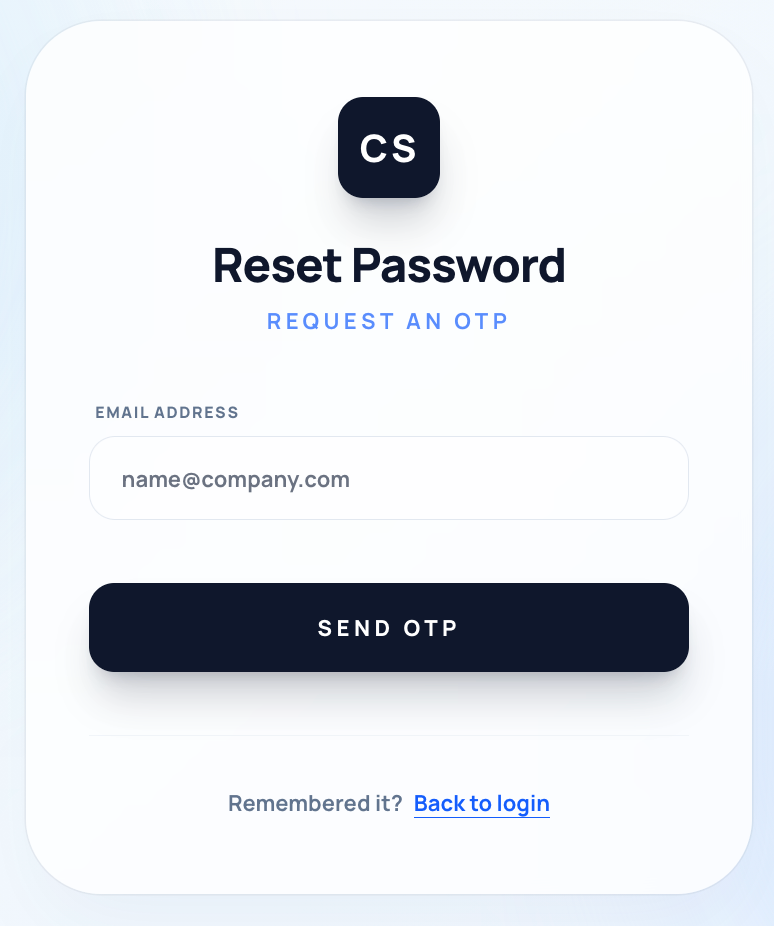

# CS Cloth

CS Cloth is a role-based merchandise storefront built with a Laravel API backend and a SvelteKit frontend. The current system supports public catalog browsing, customer checkout flows, admin inventory/order operations, and superadmin moderation/user management.

## Current System At A Glance

- `backend/`: Laravel 12 API running in Docker with MySQL, Redis, and Mailpit
- `frontend/`: SvelteKit 2 application for storefront and back-office screens
- `backend/database/seeders/DatabaseSeeder.php`: demo users, sample items, sample orders, reports, wallet balances, and addresses
- `/`: redirects by role
- `/items`: main storefront entry point for guests and customers

## What The System Currently Does

### Customer-facing

- Browse the item catalog and view item details
- Register with email OTP verification
- Log in, log out, and reset passwords
- Manage profile information
- Add items to cart and checkout
- Manage saved delivery addresses
- View order history and order details
- Request order cancellation or refunds
- View wallet balance and top up funds
- Ask product questions and report inappropriate answers

### Admin-facing

- Create, edit, hide, and delete items
- Search and sort inventory
- Review orders and mark them as shipped
- Review refund requests and approve or dismiss them
- Answer or remove customer question responses

### Superadmin-facing

- Manage admin accounts
- Manage user accounts
- Review moderation reports
- Resolve or dismiss reported answers

## Main Routes

### Frontend

- `/items`: storefront listing
- `/items/[id]`: item detail page
- `/cart`: shopping cart
- `/checkout`: checkout flow
- `/orders`: customer orders
- `/wallet`: customer wallet
- `/questions`: customer question/report history
- `/profile`: customer profile
- `/admin/items`: admin inventory management
- `/admin/orders`: admin order management
- `/admin/questions`: admin Q&A moderation
- `/superadmin/reports`: superadmin moderation queue
- `/superadmin/admins`: superadmin admin management
- `/superadmin/users`: superadmin user management

### API

Key API groups live in [backend/routes/api.php](/Users/Tan/Uni/WebTech/CS-Cloth/backend/routes/api.php):

- `/api/auth/*`: login, register OTP, password reset, profile
- `/api/items*`: public catalog
- `/api/cart*`: cart operations
- `/api/orders*`: checkout, order history, cancel, refund
- `/api/wallet*`: wallet and top-up
- `/api/admin/*`: admin item/order/question actions
- `/api/superadmin/*`: superadmin user/admin/report actions

## Tech Stack

- Backend: Laravel 12, PHP 8.2+, MySQL, Redis, Mailpit
- Frontend: SvelteKit 2, Svelte 5, TypeScript, Vite
- Styling: Tailwind CSS
- Auth: token-based API auth with role-aware routing

## Development Setup

The current project workflow uses the repository-level `./compose` wrapper to start both backend and frontend together.

### Requirements

- Docker Desktop or Docker Engine with Compose support
- `bash`

### Quickstart After Cloning

1. Clone the repository and enter the project folder.

```bash
git clone https://github.com/SkyBlueFox/CS-Cloth.git
cd CS-Cloth
```

2. Make sure Docker is running on your machine.

3. Copy the `.env.example` files to `.env` and update the database credentials.
```bash
cp backend/.env.example backend/.env
cp frontend/.env.example frontend/.env
```

4. Install backend Composer dependencies before starting Docker. This is required because `backend/vendor` is not committed and the Laravel container build uses Sail files from that directory.
```bash
cd backend
composer install
cd ..
```

If you do not have Composer installed locally, use Docker instead:
```bash
cd backend
docker run --rm \
    -u "$(id -u):$(id -g)" \
    -v "$(pwd):/app" \
    -w /app \
    composer:latest \
    composer install
cd ..
```

5. Change the following lines in `backend/.env` to activate OTP sending functionality when registering or resetting password.
```bash
MAIL_USERNAME=your-google-account@gmail.com (use your personal gmail)
MAIL_PASSWORD=your-google-app-password (use your google app password from https://myaccount.google.com/apppasswords
MAIL_FROM_ADDRESS="your-google-account@gmail.com" (use your personal gmail)
```

6. Start the full stack.

```bash
./compose up -d
```

7. Run the database migrations and seed the demo data.

```bash
./compose exec laravel-api php artisan key:generate
./compose exec laravel-api php artisan migrate:fresh --seed
```

8. Create the Laravel storage symlink if item images are missing.

```bash
./compose exec laravel-api php artisan storage:link
```

9. Open the app in your browser.

- Frontend: `http://localhost:3000`
- Backend API: `http://localhost`
- Mailpit: `http://localhost:8025`

If you change dependencies or Dockerfiles later, rebuild with:

```bash
./compose up -d --build
```

### Start the full stack

From the repository root:

```bash
./compose up -d
```

This starts:

- Laravel backend
- SvelteKit frontend
- MySQL
- Redis
- Mailpit

### Common commands

Start services:

```bash
./compose up -d
```

Stop services:

```bash
./compose down
```

View logs:

```bash
./compose logs -f
```

Rebuild containers after dependency or Dockerfile changes:

```bash
./compose up -d --build
```

### URLs

- Frontend: `http://localhost:3000`
- Backend: `http://localhost`
- Mailpit: `http://localhost:8025`

### Database and app setup

If you need a fresh seeded database:

```bash
./compose exec laravel-api php artisan migrate:fresh --seed
```

If storage symlinks are required:

```bash
./compose exec laravel-api php artisan storage:link
```

## Seeded Demo Accounts

After `./compose exec laravel-api php artisan migrate:fresh --seed`, these accounts are available:

- Superadmin: `tan@cloth.com` / `asd123`
- Admin: `admin@cloth.com` / `asd123`
- User: `sbkyajeg4312@gmail.com` / `asd123`
- User: `may@cloth.com` / `asd123`
- User: `toruplaytube@gmail.com` / `asd123`
- User: `somchai@cloth.com` / `asd123`

## Important Configuration Notes

- `./compose` is a small wrapper script around Docker Compose defined in [compose](/Users/Tan/Uni/WebTech/CS-Cloth/compose).
- The required env files for normal setup are `backend/.env` and `frontend/.env`.
- The root [.env](/Users/Tan/Uni/WebTech/CS-Cloth/.env) is optional. `./compose` will source it if present, but it falls back to your current user/group IDs when it is absent.
- Backend runtime is currently MySQL/Redis/Mailpit oriented, not the old SQLite-only manual flow.
- Uploaded item images are served from Laravel storage and stored under `backend/storage/app/public/items`.
- The frontend root page is not a marketing landing page; the usable storefront starts at `/items`, and `/` redirects by role/session state.
- Registration OTP and password reset testing depend on the mail service in the running stack.
- If you keep multiple local clones of this repo, the fixed Compose project name in `docker-compose.yml` can make one clone reuse another clone's containers.

## Compose Files

The repository uses:

- [docker-compose.yml](/Users/Tan/Uni/WebTech/CS-Cloth/docker-compose.yml)
- [backend/compose.yaml](/Users/Tan/Uni/WebTech/CS-Cloth/backend/compose.yaml)
- [frontend/docker-compose.yml](/Users/Tan/Uni/WebTech/CS-Cloth/frontend/docker-compose.yml)

Current note:

- `./compose up -d` is the intended way to run the system now.
- The wrapper injects `docker-compose.yml` and `docker.override.yml`.
- The frontend talks to the backend over the internal Docker network.

## Screenshot Placeholders

หน้าแสดงรายการสินค้าทั้งหมด

- `docs/screenshots/storefront-items.png`
  


หน้าแสดงรายการสินค้าที่เลือก

- `docs/screenshots/item-detail.png`
  


หน้าการชำระเงิน

- `docs/screenshots/cart-checkout.png`
  


หน้าการจัดการสินค้าในระบบแอดมิน

- `docs/screenshots/admin-items.png`
  


หน้าการจัดการรายการสั่งซื้อในระบบแอดมิน

- `docs/screenshots/admin-orders.png`
  


หน้าแสดงรายการคำถามและคำตอบ

- `docs/screenshots/questions.png`
  


หน้าการตอบคำถามโดยแอดมิน

- `docs/screenshots/admin-questions.png`
  


หน้าการจัดการการตอบคำถามของแอดมิน

- `docs/screenshots/superadmin-reports.png`
  


หน้ากระเป๋าเงินและการเติมเงิน

- `docs/screenshots/wallet.png`
  


หน้าจัดการผู้ใช้ในระบบ

- `docs/screenshots/superadmin-users.png`
  

หน้ารีเซ็ทรหัสหากลืมรหัสผ่าน

- `docs/screenshots/reset-password.png`
  '


## Resetting Local Data

To rebuild the local database with fresh sample data from the repository root:

```bash
./compose exec laravel-api php artisan migrate:fresh --seed
```
